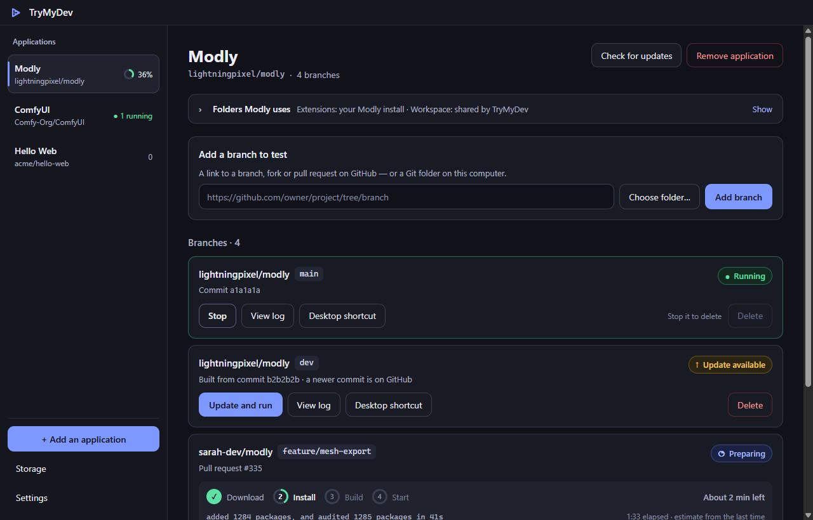
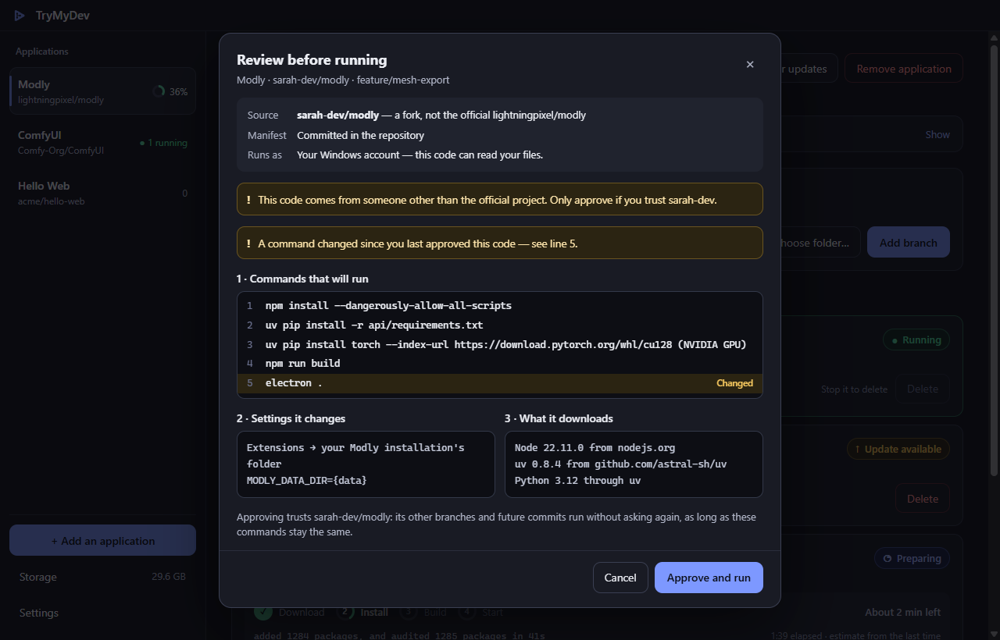
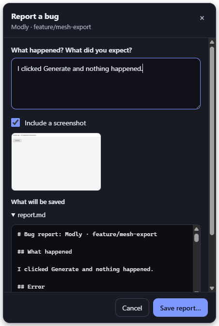

<div align="center">


# TryMyDev

**Paste a branch. Get the app.**

Hand TryMyDev to your testers. They paste the address of a branch, a fork or a pull request;
TryMyDev fetches the sources, builds them and starts the application.<br>
No Node, no Git, no Python, no build tools on their machine — and no CI or installer on yours.

[](https://github.com/Lorchie/TyMyDev/releases/latest)


[](LICENSE)

[**Download for Windows**](https://github.com/Lorchie/TyMyDev/releases/latest/download/TryMyDev-Setup.exe) ·
[macOS](https://github.com/Lorchie/TyMyDev/releases/latest/download/TryMyDev-arm64.dmg) ·
[Linux](https://github.com/Lorchie/TyMyDev/releases/latest/download/TryMyDev.AppImage)

<br>

<picture>
  <source media="(prefers-color-scheme: light)" srcset="docs/images/branches-light.png">
  
</picture>

</div>

## How it works

```
https://github.com/owner/project/tree/feat/my-branch      a branch
https://github.com/someone/project/pull/42                a pull request, fork included
owner/project@my-branch                                   the short form
C:\Users\me\code\project                                  a clone on this computer, as it is
```

1. **Paste** — a branch, a fork, a pull request, or the folder of a local clone.
2. **Review** — TryMyDev shows every command the project wants to run, and waits for your yes.
3. **Run** — sources, runtimes, install, build, start. The next time, a branch that has not
   moved starts at once.

## Highlights

|  |  |
| --- | --- |
| 🧰 **Nothing to install** | Node, Python, uv, a JDK, the Android SDK, Flutter: downloaded once, verified, shared by every application. |
| ⚡ **Built once** | Cached by commit; branches with the same lockfile share one `node_modules`, one Python environment. |
| 🔒 **Nothing runs unseen** | Every command is shown before it runs — again when it changes, again for a stranger's fork. |
| 🐞 **Bug reports in one click** | Screenshot, the tester's last steps, console errors, crashes and logs — masked, previewed, zipped. |
| 📱 **Mobile too** | Android apps on a phone or the built-in emulator; Expo projects on Android *and iPhone* through Expo Go. |
| 🤖 **Agents can test** | An MCP server lets Claude Code — or any MCP client — open a pull request and test it as a person would. |
| 💻 **Local clones** | A developer tries their own working tree, uncommitted changes included, without pushing. |

## Download

| System | Installer |
| --- | --- |
| **Windows** 10 and 11 (x64) | [**TryMyDev-Setup.exe**](https://github.com/Lorchie/TyMyDev/releases/latest/download/TryMyDev-Setup.exe) |
| **macOS** (Apple Silicon) | [**TryMyDev-arm64.dmg**](https://github.com/Lorchie/TyMyDev/releases/latest/download/TryMyDev-arm64.dmg) |
| **Linux** (x64) | [**TryMyDev.AppImage**](https://github.com/Lorchie/TyMyDev/releases/latest/download/TryMyDev.AppImage) |

Every version is on the [releases page](https://github.com/Lorchie/TyMyDev/releases). The
installers are not signed with a paid certificate yet, so the system asks once:

- **Windows** — SmartScreen says it protected your PC: *More info* → *Run anyway*.
- **macOS** — right-click the app → *Open*, then confirm (or *System Settings* → *Privacy &
  Security* → *Open Anyway*).
- **Linux** — make the file executable (`chmod +x TryMyDev.AppImage`), then run it.

## What a run does

1. **Resolve** — one conditional call to the GitHub API gives the branch's latest commit
   (for a [local repository](#local-repositories), git on the folder itself: no network).
2. **Cache** — if that commit is already built, the application starts immediately: no
   download, no install, no build.
3. Otherwise: sources → manifest → runtimes → install → build → start, with each step and an
   estimate of the time left on the branch's card.

Applications started in their own window keep running when TryMyDev closes, and show as
running again when it reopens. **Check for updates** looks for new commits; with a GitHub token
in Settings, branches are also checked every quarter of an hour, and local clones always are.
A desktop shortcut can open one branch directly (Windows).

## Nothing runs unseen

<div align="center">
<picture>
  <source media="(prefers-color-scheme: light)" srcset="docs/images/approval-light.png">
  
</picture>
</div>

A manifest is a list of commands that run on the tester's computer, and the person running
them is usually not the person who wrote them.

- **Every command is shown first.** The repository, every command that will run on this machine,
  every link and variable it sets up, and every download — then TryMyDev asks. It asks again when
  the manifest changes, and points at the lines that did. Approving trusts that repository: its
  other branches and future commits run without asking while the commands stay the same.
- **An approval is for one repository's code.** Approving a project does not approve a fork or
  a pull request from someone else with the same manifest: that code asks again, with a warning
  that it does not come from the project itself. A local clone is approved as its folder.
- **What a fork changes at install is shown.** `npm install` reads like a harmless command, but it
  runs the scripts of `package.json`. For code from someone else, the approval compares the
  install files with the official project's default branch: the lifecycle scripts and those the
  commands run, new or changed dependencies, packages fetched from outside the npm registry,
  `.npmrc`, Python requirements, Gradle files and the Gradle it downloads, and the project
  scripts the commands run themselves (`node scripts/setup.js`).
- **Credentials stay with the tester.** Environment variables named like a token, a key, a
  secret or a password, and addresses carrying a password, are not passed to applications.
  `TRYMYDEV_PASS_ENV=HF_TOKEN,OTHER` passes the ones you choose. This keeps secrets from leaking
  by accident; it is no sandbox — approved code can read your files.
- **Only the TryMyDev page talks to TryMyDev.** Another file opened in its window — one dropped
  on it — is refused, and so are its calls.
- **Web applications are contained.** Their windows are sandboxed, keep their own cookies per
  branch, cannot use the camera, microphone or location, and send any other site to the
  browser. Only web addresses ever leave TryMyDev.
- **Runtimes are verified** — Node and uv against digests shipped in TryMyDev, the others against
  their published checksums — and not run when that check is impossible.
- **The packaged launcher is locked**: it cannot be used as a Node interpreter, and only loads
  its own integrity-checked archive.

Running a branch still runs its code with your account — review who publishes what you test.

## Reporting a bug



Every tested application — web or Electron — gets a small tools button in a corner of its
window; drag it to either edge and it stays there. **Report a bug** prepares a report of what
just happened: a screenshot, the tester's clicks, the fields they typed in and the shortcuts
they used over the last ten minutes, console errors, crashes, the end of the branch's log and
the machine it ran on. The tester describes the problem, reads the whole report, and saves a
`.zip` (`report.md`, `screenshot.png`, `logs.txt`) to send to the developer.

What is typed is never recorded — only the field it went into — and password fields are
ignored. Tokens, secrets named as such, e-mail addresses, user folders, the computer's name,
web address parameters and public IP addresses are masked, in the description too. Masking
catches what it recognises: the preview is there so the tester checks before sending. The
screenshot is not masked; it can be left out. The button can be switched off in Settings.

For an Android application, *Report a bug* sits on the branch's card and gathers the same from
the device: its screen, the application's errors and crashes from logcat, and the device itself.

<br clear="right">

## The manifest

A manifest says how the project runs. TryMyDev looks for it in this order:

1. **`trymydev.json` committed in the repository**, read at the commit being tested — so a
   branch that changes its own build is tested exactly as it is.
2. **A manifest you hand to your testers**, pasted when they add the application. Nothing has
   to change in the repository, which is what makes this work on any project.
3. **A profile shipped with TryMyDev**, for a few well-known projects and their forks.
4. **Detection**, for ordinary npm and Python projects, and for the usual [mobile](#mobile-applications)
   shapes: Flutter, an Android project with its Gradle wrapper, React Native, Capacitor, Expo.

```json
{
  "name": "My App",
  "repo": "owner/project",
  "runtime": { "node": "22", "python": "3.13" },
  "install": [
    { "run": "npm install" },
    { "run": "pip install torch --extra-index-url https://download.pytorch.org/whl/cu130", "when": { "gpu": "nvidia" } },
    { "run": "pip install -r requirements.txt" }
  ],
  "build": [{ "run": "npm run build" }],
  "start": [
    { "mode": "web", "run": "python main.py --port {port}", "port": 8188, "when": { "gpu": "nvidia" } },
    { "mode": "web", "run": "python main.py --cpu --port {port}", "port": 8188 }
  ],
  "share": [{ "path": "models" }],
  "isolate": [{ "env": "MYAPP_HOME", "dir": "home" }],
  "cacheKeys": { "node": ["package-lock.json"], "python": ["requirements.txt"] }
}
```

<details>
<summary><b>Every field</b></summary>

| Field | What it does |
| --- | --- |
| `start.mode` | `electron` (own user-data dir), `web` (served, opened in a window), `command`, `android` (an APK installed on a phone or the emulator), `expo` (an Expo dev server opened in Expo Go) |
| `android` start | `apk` — the file, or a folder searched for the newest one; `package` — the application id, read from the APK (or the Gradle build) when absent; `artifact` — a GitHub Actions artifact holding the APK, taken instead of building when one exists for the commit |
| `start` as a list | Variants; the first whose `when` matches the machine is used |
| `when` | Runs a step, or picks a start, only on some machines: `platform` (`windows`, `macos`, `linux`) and `gpu` (`nvidia`, `amd`, `none`), one value or a list |
| `share` | Directories that belong to the application, not to one branch — models, caches |
| `isolate` | Variables redirected per branch, so two branches never write to the same place |
| `seed` | Files and links placed in the branch data folder before it starts — `{ "path", "json" }`, written once unless `"always": true`, `"merge": true` to set its keys at every start and keep the rest of the file, or `{ "path", "link" }`. Strings may use `{data}`, `{shared}`, `{short}`, `{venv}`, `{documents}`, `{appData}`, `{folder:<id>}` and `{sha256:<file>}` — `{short}` is a folder near the top of the home directory, for Python trees too deep for the 260-character limit of Windows |
| `folders` | Folders the tester can switch, shown in the application's page: `{ "id", "label", "own", "installed", "use" }` — `own` is TryMyDev's (`{shared}/…` or `{short}/…`), `installed` an installed copy's (`{ "file", "key", "usual" }`: the path its settings file names, else its usual place), `use` which one until the tester switches. Seeds use it as `{folder:<id>}` |
| `cacheKeys` | Files whose hash decides when an environment must be rebuilt |
| `{port}` | Replaced with a free port, so two branches run side by side |
| `runtime` | A Node version or range (`22`, `>=20`) and a Python version (`3.13`); latest release of that line. `java` (`17`, `21`) and `flutter` (`3.24.5`) for mobile builds |

</details>

Commands are split on spaces, honouring quotes, and run without a shell: no pipes, no `&&`,
no variable expansion — `.cmd` and `.bat` files included, whose arguments are escaped. Paths
in `share`, `isolate`, `seed` and `cwd` must stay inside the project or the data folder, and a
seed link must start with one of its folders.

## Mobile applications

The tester needs nothing installed for these either: TryMyDev downloads what the project asks
for, once, and only when a project asks for it.

| Project | What runs | Where it runs |
| --- | --- | --- |
| Expo, without an `android` folder | `npx expo start` | **Expo Go**, on Android *and iPhone*: a QR code in TryMyDev's window |
| Flutter | `flutter build apk --debug` | Android phone or emulator |
| Android (Gradle wrapper) | `gradlew assembleDebug` | Android phone or emulator |
| React Native, Expo with an `android` folder | `gradlew assembleRelease` (it carries its JavaScript) | Android phone or emulator |
| Capacitor | `npm run build`, `npx cap sync android`, `gradlew assembleDebug` | Android phone or emulator |

**A phone first.** A phone plugged in with *USB debugging* on (Developer options) gets the
application, and its screen is shown on the computer with [scrcpy](https://github.com/Genymobile/scrcpy):
the tester uses it there or on the phone. Without one, TryMyDev's own emulator starts — a
recent Android with Google APIs — and stays running for the next start. It needs the
computer's virtualization (*Windows Hypervisor Platform* on Windows); TryMyDev says so when
it is missing.

<details>
<summary><b>Downloads, licence, prebuilt APKs and limits</b></summary>

- **Downloaded once, checked first**: a JDK (Eclipse Temurin, sha256 from Adoptium), the Android
  SDK tools and platform-tools (sha1 from Google's own repository index), scrcpy (pinned
  sha256), Flutter (sha256 from Google's release index) and, for Flutter on Windows, MinGit. Gradle
  then fetches what the project names. Gradle runs without a daemon, so nothing keeps holding
  the branch's files.
- **The Android SDK licence is the tester's to accept**: the approval lists it with its address,
  and approving accepts it. TryMyDev's SDK, emulator and signing key live in its own store,
  never in `~/.android`, and the Android CLI is run with `--no-metrics`.
- **An APK built by GitHub Actions** is used instead of building, when the manifest names its
  artifact (`"artifact": "app-debug"`) and one exists for the very commit — on the repository,
  or on the one a pull request targets. GitHub serves artifacts to signed-in users only: it
  needs the token in Settings, and builds locally otherwise — or when the artifact cannot be
  fetched.
- **An application already installed from elsewhere is never uninstalled**: a published version
  signed with another key makes the installation fail, and TryMyDev says why — uninstalling it
  would delete its data.
- **Agents work on Android too**: they read the screen as text (`uiautomator`), tap, type, swipe
  and press keys through adb, and write the same bug report.
- **iPhone**: through Expo Go only. Building an iOS application needs a Mac with Xcode, which
  Apple distributes through the App Store alone, and a signing account — out of reach of a
  download.

</details>

## Local repositories

A developer can try their own clone without pushing anything. Paste the clone's absolute path,
or pick it with **Choose folder…**:

```
C:\Users\me\code\project                 the folder as it is
C:\Users\me\code\project@feat/my-branch  the last commit of one branch
/home/me/code/project
```

**Just the folder follows it as it is**: each start builds whatever is checked out — switch
branches and the next start builds the new one — with every change, staged or not, and every
new file, tracked or not. Only what `.gitignore` excludes is left out. `@branch` pins one
branch's last commit instead.

<details>
<summary><b>How it reads the folder, and what it refuses</b></summary>

- **Git is required** here, and only here: TryMyDev runs the git already on the computer
  (`rev-parse`, `add`, `write-tree`, `archive`), never through a shell, and never lets the
  repository's own config start a program before you approve: its change monitor is switched
  off, and a folder whose `.git/config` declares its own filters (other than Git LFS's) is
  refused. It says so when git is missing.
  Paths must be absolute, and branches must pass `git check-ref-format --branch`.
- **The application comes from `origin`.** A GitHub remote gives `owner/repo`, then the root
  of its forks, as for a fork pasted from GitHub: a clone of Modly lands in Modly, with its
  models, extensions and built-in profile. Without a GitHub remote, the clone is an
  application of its own, named after its folder.
- **The sources are read with `git archive`** and extracted the way GitHub's archive is.
  The folder as it is comes from `git add --all` on a *copy* of your index, then
  `git write-tree`: your branch, index and stash are left as they are. Everything after —
  manifest, approval, install, build, caches — is the same as for GitHub.
- **Checking for changes is free and writes nothing**: a folder is compared by its HEAD, what
  `git status` lists and those files' size and time — never with GitHub, so it is checked
  automatically even without a token. The sources are only read again when that moved.
- **Untracked files have a limit**: past 100 MB or 10,000 files that `.gitignore` lets through,
  the start stops and names the largest — a forgotten model or virtual environment would be
  copied into every build. Ignore them, or use `@branch`.
- **Ignored `.env` files are said**: the build lacks them, as a tester's copy would, and the
  branch's log says so before the application fails for a missing setting.
- **An approval is for the folder.** Approving the repository on GitHub does not approve a
  clone of it, nor the reverse: the clone asks once, and says it is read from this computer.

On a clone of Modly (327 tracked files, 1.2 GB on disk with its ignored folders): reading the
folder took 0.3 s the first time and 70 ms unchanged, `git archive` 2.4 s for 23.5 MB, extracting
0.8 s; the repository gained a few kilobytes of objects, and nothing for an unchanged folder.

</details>

## Testing with an agent

An agent on your computer — Claude Code, or any MCP client — can test branches as a tester
would. To connect Claude Code:

1. Open **Settings** → **Agent access** and switch on **Let an AI agent test the applications**.
2. Click **Copy the Claude Code command**: the command that adds TryMyDev to Claude Code, with
   this computer's own access token, is now in your clipboard.
3. Paste it once in a terminal and run it.

The copied command holds your token: run it, but never share it — in an issue, a chat or a
screenshot. If it ever leaks, **Revoke and make a new token** in the same place.

Then ask it, say, *"test pull request 42 of Modly: open the Extensions page and check that
installed extensions load"*. It opens the pull request (`open_branch`, which also takes the
absolute path of a [local clone](#local-repositories)), reads the window as text (`snapshot`)
or as an image (`screenshot`), clicks, types, presses keys and scrolls with real input events,
reads console errors and the branch's log — a backend's errors are only there — and writes the
same bug report the **Report a bug** button does, beside the branch's log.

- It never approves a manifest: a branch nobody approved waits for you in TryMyDev's window.
- It cannot run script in a page, only act as a person would.
- The server only answers on this computer, with the token; web pages are refused. A new token
  replaces the old one, which stops working at once.
- It needs the tools button, and applies to branches started once it is on.

## Folders of an application

An application's page shows the folders a branch uses, and each can be switched: **Use Modly's**
for the installed application's folder, **Use TryMyDev's** for TryMyDev's own, shared by every
branch, or **Choose folder…** for any other. For Modly, extensions are the installed Modly's by
default — some weigh 50 GB, a second set would fill the disk — while the workspace and the
workflows are TryMyDev's, so a branch still in development never touches your own. A switch
applies the next time a branch starts, to branches added before as well.

## Caches and storage

| Cache | Key | Effect |
| --- | --- | --- |
| Build | commit | Nothing to do when the branch has not moved |
| `node_modules` | lockfile, Node version, install commands | Branches — and applications — sharing them share one install |
| Python environment | requirements, Python version, install commands | Complete venv per set; `uv` hardlinks the wheels, so a branch that changes one dependency costs almost nothing |
| Runtimes | version | Node, Python and uv, the JDK, the Android SDK, Flutter: downloaded once, used by every application |
| Downloads | — | uv, pip, npm, Electron, Gradle and pub caches, kept inside TryMyDev's own folder |
| `share` directories | application | Models and other heavy data live once per application |

**Storage** shows what is used and removes what nothing references any more — download caches
included, when nothing is installing. Each time TryMyDev starts, it also removes by itself what
nothing uses any more: environments no branch points at, what removed branches left behind,
and download caches unused for two weeks. Branches, runtimes, models, extensions, workspaces and
workflows are never touched, and the cleanup can be switched off in Settings. A start that has
to install stops first when less than 5 GB are free.

## Settings

- **Appearance** — match the system, dark or light.
- **GitHub token** — optional. Without one, GitHub allows 60 requests an hour and no private
  repository, so branches are checked only when you ask; with one, 5,000, the repositories it
  can read, and automatic checks. Use a fine-grained token with read-only access to contents
  and nothing more. It is checked with GitHub before it is kept, and stored encrypted by the
  operating system — never where the system offers no real encryption. That encryption is tied
  to your account, which the applications you approve run under too.
- **Tools button**, **Agent access** and **cleanup at start** can each be switched off.

## Every tester's machine is different

<details>
<summary><b>What TryMyDev does so a branch installs the same everywhere</b></summary>

- `NODE_OPTIONS`, `NODE_ENV`, npm's `ignore-scripts` and `omit`, `PYTHONPATH`, `PYTHONHOME`,
  `PIP_USER`, uv's Python settings, activated virtual or conda environments, and the tester's own
  `JAVA_HOME`, Android SDK, Gradle and Flutter settings are left out. A manifest that needs one
  sets it in `env`. Mirrors and registries (`ELECTRON_MIRROR`, `npm_config_registry`,
  `PIP_INDEX_URL`) are kept.
- Python runs in UTF-8 and unbuffered, without the tester's `pip install --user` packages.
- Downloads use the proxy, PAC file and certificates of the system; npm, pip and uv receive
  that proxy unless `HTTPS_PROXY` is already set. On a network that inspects encrypted traffic,
  set `UV_SYSTEM_CERTS=true` for uv.
- The PyTorch build follows the NVIDIA driver and GPU: CUDA 13 on a 580 driver from Turing on,
  CUDA 12.6 for older GPUs or drivers, CUDA 12.8 for Blackwell on a driver older than 580.
- On Windows, data goes to `%LOCALAPPDATA%\TryMyDev` — never Roaming, which a company network
  copies at each logon. A profile created in Roaming by an earlier version stays there.
- Downloads that stall are dropped and cancellable; files an antivirus holds are retried; a
  server gets as long as it needs to start, as long as it prints or serves something within
  five minutes; ports are checked on IPv4 and IPv6.
- Source archives include neither submodules nor Git LFS content; the approval says so.

</details>

## When something fails

The error pop-up carries the end of the log, and — for failures seen before, such as a
PyTorch without GPU support, a port already taken, a missing build toolchain or a Java version
the build does not accept — what to do about it. Failures outside any branch go to TryMyDev's
own log, `logs/main.log`. An unreadable `registry.json` is reported and left untouched, and
nothing is deleted meanwhile: TryMyDev keeps the registry as it was before its last change,
`registry.backup.json`, and offers to restore it.

## What it cannot do

Honest limits, independent of the language:

- **Native compilation** — a project needing a C/C++ toolchain, node-gyp or Rust requires
  that toolchain on the tester's machine. Prebuilt binaries are fine; compiling is not.
- **External services** — Postgres, Redis, docker-compose.
- **Native iOS applications** — see [Mobile applications](#mobile-applications): Expo Go only.
- **Secrets** — an application needing API keys does not start from a URL alone.
- **pnpm, yarn and bun** are not provided: their `node_modules` rely on links that moving the
  tree into the shared store would break. A manifest can still drive them if they are
  installed.

## Development

```bash
npm install
npm run dev
npm run typecheck
npm test               # unit tests; TRYMYDEV_NETWORK_TESTS=1 adds the download test
npm run test:e2e       # builds, then drives the real window
npm run package        # Windows; package:mac and package:linux for the others
npm run icons          # resources/icon.svg → the icons of the three systems
```

A release is a tag: `git tag v0.2.0 && git push origin v0.2.0` builds the three installers on
GitHub Actions and attaches them to a new release, which the download links above follow.

Open one branch directly — what a desktop shortcut does:

```bash
trymydev --start=owner/project@my-branch
trymydev --start=C:\Users\me\code\project
```

<details>
<summary><b>File layout</b></summary>

```
<TryMyDev userData>/
  registry.json                    applications, branches, approvals and folder switches
  registry.backup.json             the registry before its last change
  settings.json                    GitHub and agent tokens, encrypted
  logs/main.log                    TryMyDev's own log
  apps/<app>/branches/<ref-hash>/  checkout, data, logs, state
  apps/<app>/shared/               shared directories of that application
  store/node/<version>             Node runtimes
  store/pythons/                   Python runtimes, managed by uv
  store/uv/<version>               uv
  store/java, flutter, scrcpy, git JDKs, Flutter releases, scrcpy, MinGit
  store/android/{sdk,avd,user}     the Android SDK, the emulator's virtual phone, its settings
  store/cache/<tool>               uv, pip, npm, Electron, Gradle and pub caches
  store/node-deps/<hash>/node_modules
  store/venvs/<hash>               Python environments
  store/shims/<runtime>            node / npm / npx wrappers, one set per runtime
```

`<TryMyDev userData>` is `%LOCALAPPDATA%\TryMyDev` on Windows (`%APPDATA%\TryMyDev` for a profile
created by an earlier version), `~/Library/Application Support/TryMyDev` on macOS and
`~/.config/TryMyDev` on Linux.

</details>

## License

[MIT](LICENSE)
